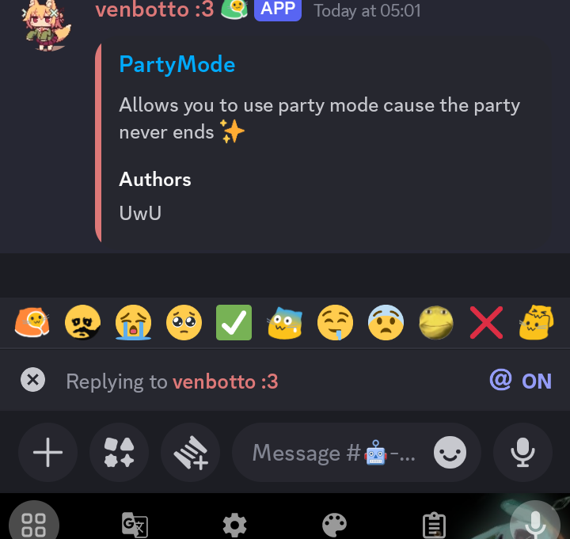

# ReactionBar

Shows a quick-access bar of reaction buttons to a message you're replying to.

Lets you avoid the slow context menu when reacting to a message by simply using swipe-to-reply and this plugin.

